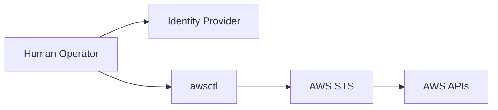

# arch-awsctl-mission.md

# 🎯 awsctl — Architectural Mission

This document defines the **architectural mission** of `awsctl`. It explains **why the system exists**, the **constraints it must never violate**, and the **boundaries that shape every design decision**.

This document is authoritative.

---

## 🏗️ Mission Statement

`awsctl` exists to provide a **safe, explicit, and auditable identity brokerage layer** between human operators and AWS.

It translates **human intent** into **controlled AWS execution** without becoming an authority itself.

---

## 🔍 The Problem awsctl Solves

In mature AWS environments, the highest risk does not come from infrastructure — it comes from **human access paths**. 

Common failure patterns include:
* **Implicit behavior:** Standard CLI tools often hide credential logic, leading to "fat-finger" errors.
* **Policy Bypass:** Human access often bypasses the strict organizational guardrails applied to automation.
* **Speed Over Safety:** Traditional tooling optimizes for velocity, increasing the blast radius of mistakes.

`awsctl` exists to **constrain human access**, not to provision infrastructure.

---

## 🎯 Core Design Goal

> Make the *safe path* the *obvious path*, and make unsafe paths **explicit, slow, and visible**.

`awsctl` achieves this by refusing to guess intent, failing early and loudly, and requiring explicit human confirmation for any elevated risk.

---

## 🧱 What awsctl Is (and Is Not)

| awsctl Is... | awsctl Is NOT... |
| :--- | :--- |
| A **client-side identity broker** | An authentication system |
| A **human access control surface** | A credential store |
| A **policy-enforcing execution gate** | An IAM replacement |
| A **guardrail around AWS STS usage** | An automation engine |

**Intentional Decoupling:** If `awsctl` is removed, AWS access must still function via native paths. This ensures the tool never becomes a "black box" that operators cannot bypass during a recovery scenario.

---

## ⚖️ Trust & Authority Model

`awsctl` has **no intrinsic authority**. Authority is coordinated from external sources:
1.  **Identity Provider:** Proves who the human is (Authentication).
2.  **AWS IAM:** Defines what the role can do (Authorization).
3.  **Declarative Configuration:** Defines organizational intent (Policy).
4.  **Human Confirmation:** Proves deliberate action (Intent).

---

## 🔄 Conceptual Flow (Mermaid)

`awsctl` sits between proof and power, brokering intent rather than identity.

---

## ✅ Non-Negotiable Constraints

The following constraints must never be violated. Breaking any of these invalidates the system:
1.  `awsctl` **never** authenticates users.
2.  `awsctl` **never** stores credentials on disk.
3.  `awsctl` **never** escalates privilege beyond what IAM allows.
4.  `awsctl` **never** bypasses organizational policy.
5.  `awsctl` **never** hides failure or denial errors.

---

## 🚦 Failure as a Feature

`awsctl` is designed to fail early, loudly, and safely. A failure is not necessarily an "error" in the code; it is a **security control** indicating a policy mismatch or ambiguous intent. There are no silent fallbacks to weaker security states.

---

## 📝 Summary

The mission of `awsctl` is not to do more — it is to do **less, correctly**. Its power comes from removing ambiguity and ensuring that every administrative action is conscious, scoped, and auditable.

> [!IMPORTANT]
> This document anchors the entire architectural framework. If other technical documents conflict with the mission stated here, this document wins.
