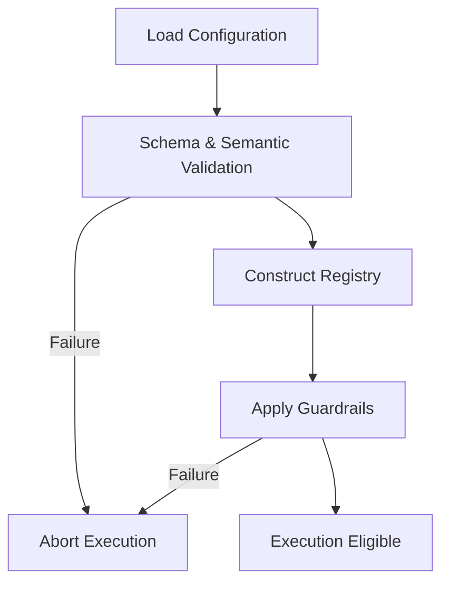

# arch-configuration-model.md

# 🏛️ Architecture — Configuration Model

This document defines the **architectural role of configuration** in `cloudctl`. It explains why configuration exists, how it is evaluated, and where its authority begins and ends within the system's trust boundaries.

This document is authoritative.

---

## 🏗️ Purpose of Configuration in cloudctl

In `cloudctl`, configuration is **policy**, not preference. It exists to **constrain human intent before execution**.

**Configuration determines:**
* **Visibility:** What accounts and roles are even visible to the user.
* **Selectability:** What options can be chosen for the current session.
* **Allowance:** What actions are permitted under organizational rules.
* **Confirmation:** Which high-risk actions require explicit human acknowledgment.

---

## 🛰️ Configuration as a Control Plane

`cloudctl` configuration functions as a **client-side control plane**. It is evaluated at the very beginning of the lifecycle:
1. Before any AWS API calls are made.
2. Before any credentials (STS) are issued.
3. Before any local environment changes occur.

If configuration evaluation fails, execution **does not begin**.

---

## ⚖️ Authority Boundary

The configuration model defines a strict line between local intent and cloud authority.

| Configuration is Authoritative for... | Configuration is NOT Authoritative for... |
| :--- | :--- |
| Account and Role visibility | User Authentication (IdP) |
| Region eligibility | AWS IAM policy content |
| Guardrail enforcement | Actual Credential issuance (STS) |
| Plugin enablement | Authorization enforcement inside AWS |

---

## 🔄 Evaluation Lifecycle

Configuration evaluation follows a strict, non-permissive lifecycle. No execution occurs until this process completes successfully.

---

## 🗂️ The Registry Model

Once validated, the configuration is transformed into an **in-memory registry**.
* **Immutable:** Cannot be changed once loaded.
* **Deterministic:** Same config leads to the same registry state.
* **Sole Source:** Every command must consult the registry; nothing bypasses it.

---

## 🚫 No Implicit Defaults

`cloudctl` deliberately avoids "smart" behavior that creates ambiguity.
* **Forbidden:** Auto-discovering accounts, assuming a "current" profile, or guessing regions.
* **Principle:** If the configuration does not explicitly allow a resource or action, **it does not exist** to the tool.

---

## 🚦 Failure Semantics

Configuration failure is a **terminal condition**. There is no "permissive" or "best-effort" mode.
* **Triggers:** Unknown fields, invalid types, empty allowlists, or conflicting constraints.
* **Outcome:** Immediate abort, clear error message, and zero partial state.

---

## ⚔️ Configuration vs. Flags

Policy flows in one direction: **Configuration → Execution**.

* **Flags May:** Select from allowed options, increase verbosity, or opt into interactivity.
* **Flags May NOT:** Override configuration, expand scope, bypass guardrails, or change policy.

---

## ✅ Non-Negotiable Invariants

1. **Static & Explicit:** No runtime mutation or environment-variable overrides of core policy.
2. **Deterministic:** Given the same configuration and input, the behavior must be identical.
3. **Isolated Environments:** Separate files are used for different environments (Dev/Prod) to avoid hidden coupling or inheritance errors.

---

## 📝 Summary

In `cloudctl`, configuration is policy encoded as data. It is evaluated early, enforced strictly, and is central to the safety of the identity brokerage layer. If configuration is ambiguous, execution does not proceed.

> [!IMPORTANT]
> This document defines the architectural behavior of configuration. For specific field definitions, refer to the [[Configuration Schema|Configuration-Schema]].
