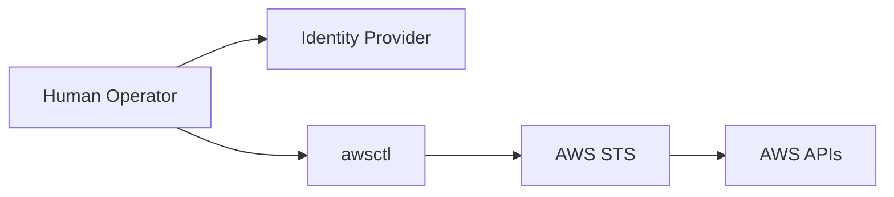

# architecture-mission.md

# 🎯 Architecture Mission

This document defines the **architectural mission** of `awsctl`. It explains why `awsctl` exists, the problems it solves, and the fundamental constraints that shape every design decision.

This document is authoritative.

---

## 🏗️ Mission Statement

`awsctl` exists to provide a **safe, explicit, and auditable identity brokerage layer** between human operators and AWS.

It translates **human intent** into **controlled AWS execution** without becoming an authority itself.

---

## 🔍 The Problem awsctl Solves

Modern AWS environments suffer from human access risk, not just infrastructure provisioning flaws. `awsctl` addresses:
* **Overloaded CLI usage:** Preventing "fat-finger" errors in complex environments.
* **Implicit behavior:** Eliminating hidden assumptions in copy-pasted scripts.
* **Policy bypass:** Ensuring human access paths remain within organizational guardrails.
* **Speed vs. Safety:** Re-balancing the trade-off to prioritize correctness over velocity.

---

## 🎯 Core Design Goal

> **Make the *safe path* the *obvious path* and make unsafe paths explicit, slow, and visible.**

`awsctl` achieves this by refusing to guess, failing early, surfacing scope clearly, and preserving audit evidence.

---

## 🧱 What awsctl Is (and Is Not)

| awsctl Is... | awsctl Is NOT... |
| :--- | :--- |
| A client-side identity broker | An authentication system |
| A policy enforcement surface | A credential authority |
| A human-focused control plane | An IAM replacement |
| A guardrail for AWS access | An automation engine |

**Intentional Decoupling:** If `awsctl` is removed, AWS access must still function via native paths. This ensures `awsctl` never becomes a single point of failure for organizational recovery.

---

## 🗺️ High-Level Architectural Flow

`awsctl` does not sit between the IdP and AWS as a proxy; it brokers intent, not identity.

### 🔄 Intent Brokerage (Mermaid)

---

## ⚖️ Authority and Determinism

* **Authority Model:** `awsctl` has no intrinsic authority. It coordinates IdP authentication, IAM trust policies, and explicit local configuration.
* **Determinism:** Given the same configuration, identity, and command, `awsctl` must behave identically. Implicit defaults or "smart" guessing are prohibited.
* **Failure as a Feature:** Failure is a security control. If a policy mismatch or ambiguous intent is detected, `awsctl` fails loudly and safely.

---

## 👥 Human-Centric Design

`awsctl` is optimized for **human clarity** and **deliberate action**. It intentionally avoids "one-liner" automation and silent escalation. Humans remain accountable for the actions they take; the tool ensures they are fully aware of the risk and scope before execution.

---

## ✅ Non-Negotiable Constraints

The following constraints must never be violated. Breaking any of these invalidates the system:
1. `awsctl` **never** authenticates users.
2. `awsctl` **never** stores credentials on disk.
3. `awsctl` **never** escalates privilege.
4. `awsctl` **never** bypasses organizational policy.
5. `awsctl` **never** hides failure or denial errors.

---

## 📝 Summary

The mission of `awsctl` is not to do more—it is to do **less, correctly**. Its power comes from restraint, deterministic behavior, and the preservation of explicit boundaries.

> [!IMPORTANT]
> This document anchors the entire architectural framework. If other technical documents conflict with the mission stated here, this document wins.

