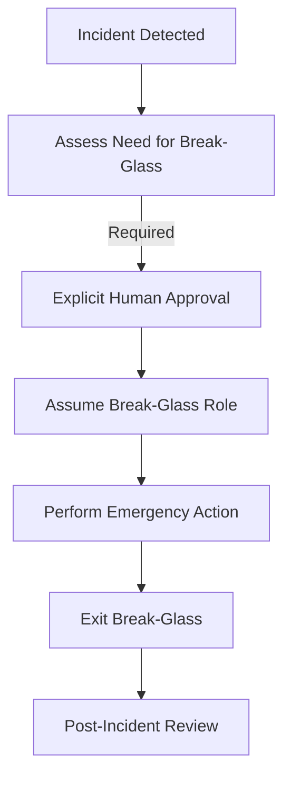

# break-glass-procedure

# 🚨 Break-Glass Procedure

This document defines the **emergency access (“break-glass”) procedure** for `cloudctl`-managed environments. It describes when break-glass is permitted, how it is obtained, and the post-incident requirements.

This document is authoritative.

---

## 🏗️ What Break-Glass Means

**Break-glass access** is emergency, human-initiated access used only when normal access paths are unavailable or automation is impaired. 

**Break-glass is:**
* **Explicit:** Requires human intent and approval.
* **Rare:** Not for routine maintenance or speed.
* **Auditable:** Every action must be captured in CloudTrail.
* **Time-bound:** Sessions must expire automatically.

---

## 🚦 When Break-Glass Is Allowed

| ✅ Permitted Conditions | ❌ Prohibited Usage |
| :--- | :--- |
| Identity Provider (IdP) outage | Bypassing policy disagreements |
| `cloudctl` malfunction preventing access | Testing or routine maintenance |
| CI/CD pipeline failure blocking remediation | General convenience or speed |
| Active security incident response | Circumventing existing guardrails |

---

## 🛡️ cloudctl’s Role in Break-Glass

`cloudctl` **does not provide** break-glass access. This is an intentional architectural choice. 

Break-glass exists **outside** the `cloudctl` control plane. This ensures:
1. **Redundancy:** If `cloudctl` fails, recovery is still possible.
2. **Independence:** Emergency paths do not rely on the tool they are meant to bypass.
3. **Non-Authority:** `cloudctl` remains a broker, never the ultimate root of trust.

---

## 🔄 Break-Glass Access Mechanism

Break-glass access is provided via pre-created IAM roles that exist **before** an incident. These roles should have trust policies that do not depend on external IdPs if those IdPs are the point of failure.

### 🛰️ Typical Break-Glass Flow (Mermaid)

---

## 🔐 Controls and Constraints

Break-glass roles must enforce:
* **MFA Required:** No exceptions for emergency access.
* **Session Duration:** Strictly limited (e.g., 1 to 4 hours).
* **Logging:** Must produce high-fidelity CloudTrail `AssumeRole` events.
* **No Trust Chaining:** Roles should not be able to assume other highly privileged roles without re-authentication.

---

## 🧾 Mandatory Post-Incident Actions

Every break-glass event is a deviation from standard operating procedure and requires:
1. **Session Termination:** Immediately revoke active sessions once remediation is complete.
2. **Credential Rotation:** Rotate any secrets or keys touched during the incident.
3. **Written Review:** A post-incident report detailing the timeline, actions performed, and root cause.
4. **System Fix:** If `cloudctl` was the reason for break-glass, a bug report or architecture review must follow.

---

## 📝 Summary

Break-glass access is rare, explicit, and human-controlled. `cloudctl` deliberately stays out of the way of emergency recovery to ensure that the organization is never "locked out" by its own security tooling.

> [!IMPORTANT]
> If you are using break-glass often, fix the system—not the procedure. Frequent break-glass usage is a sign of architectural failure.
