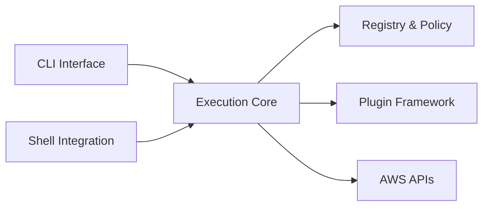

# developer-architecture-guide.md

# 🛠️ Developer Architecture Guide

This document explains the **internal architecture** of `awsctl`. It is written for maintainers, core contributors, and security reviewers to ensure future changes do not weaken the tool's security guarantees or collapse its trust boundaries.

It is **not** a user guide.

---

## 🧭 Purpose & North Star

`awsctl` is a **client-side identity broker**. It is not an authentication system, credential store, or orchestrator. If a proposed feature pushes the tool toward becoming a general-purpose AWS wrapper or a stateful engine, it is architecturally out of scope.

---

## 🏗️ High-Level Architecture

The system is composed of decoupled layers with strict responsibilities. No component is permitted to bypass the Core Execution Engine.

### 🔄 Architectural Flow (Mermaid)

---

## 🧱 Layer Responsibilities

### CLI Layer (`cli.py`, `cli_*`)
* **Role:** A translator for human intent.
* **Responsibilities:** Parsing flags, routing commands, and rendering output.
* **Constraints:** No direct AWS calls; no environment mutation.

### Core Execution Engine (`core.py`)
* **Role:** The authoritative coordinator.
* **Responsibilities:** Enforcing execution flow, coordinating validation, and maintaining invariants.
* **Rules:** Every command must pass through the Core; partial execution is strictly forbidden.

### Registry & Policy Engine (`registry.py`, `config.py`)
* **Role:** The declarative policy constraint layer.
* **Responsibilities:** Loading policy, validating schema, and enforcing allowlists.
* **Constraints:** Registry is read-only at runtime; ambiguity is treated as a hard failure.

### Identity & AWS Interaction (`aws.py`, `context_manager.py`)
* **Role:** The interface to the AWS Control Plane.
* **Responsibilities:** Performing `AssumeRole` and surfacing AWS errors verbatim.
* **Constraints:** **No credential storage or caching** beyond the process lifetime.

### Plugin Framework (`plugins/`)
* **Role:** Extensibility boundary.
* **Responsibilities:** Integrating external systems (e.g., IdPs) and enriching metadata.
* **Rules:** Plugins are untrusted; they cannot bypass policy or credentials.

### Shell Integration (`shell.py`)
* **Role:** Ergonomic context switching.
* **Responsibilities:** Emitting shell-safe environment changes.
* **Constraints:** No implicit shell modification; output must be machine-parseable.

---

## 🚦 Operational Safety

### Failure Handling
`awsctl` enforces a **fail-fast, fail-safe** model. Failure semantics are a core architectural feature:
* No retries on authorization (403) failures.
* No silent fallbacks to default credentials.
* **Fail Closed:** If any part of the validation chain fails, no credentials are issued.

### Non-Negotiable Invariants
Breaking any of these constitutes a security bug:
1. `awsctl` never authenticates users (external IdP only).
2. `awsctl` never stores credentials on disk.
3. `awsctl` never escalates privilege beyond what IAM allows.
4. `awsctl` never "guesses" user intent.

---

## 🧪 Testing Philosophy

Tests must prioritize **edge cases, failure paths, and guardrail enforcement**. Happy-path testing is considered insufficient. If a code change is made without updating the corresponding security or architecture documentation, the PR is incomplete.

---

## 📝 Summary

As a maintainer, your primary responsibility is to protect the **explicit boundaries** and **deterministic behavior** of `awsctl`. Convenience must always be subordinate to the predictable failure and security properties defined in this guide.

**Related Documentation:**
* [[Security Overview|Security-Overview]]
* [[Trust and Security Boundaries|Trust-and-Security-Boundaries]]
* [[Registry and Policy Model|Registry-and-Policy-Model]]
* [[Plugin Framework|Plugin-Framework]]
* [[Failure Modes & Mitigation|Failure-Modes-and-Mitigation]]