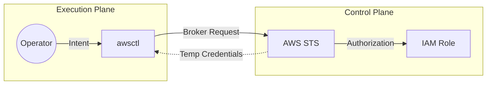

# 🎨 Diagram Standards

This document defines the **authoritative standards** for creating, reviewing, and publishing diagrams within the `awsctl` ecosystem. 

In a security-sensitive project, visual ambiguity is a risk. This document ensures that all architectural visualizations are as deterministic and version-controlled as the code itself.

---

## 🏛️ Core Principles

1.  **Diagram-as-Code (DaC) Only:** No binary blobs, manual exports, or screenshots. Every diagram must be regenerable from text.
2.  **Version Controlled:** Source files must reside in the repository (`docs/diagrams/`).
3.  **Reviewable:** Diagrams are vetted during Pull Requests for architectural accuracy and trust boundary alignment.
4.  **Accessibility:** High contrast and standard iconography must be used to ensure clarity across different viewing environments.

---

## 🛠️ Supported Tooling

### 1. Mermaid.js
Used for **conceptual flows, logic branches, and sequence diagrams**. 
* **Storage:** Inlined directly within Markdown files.
* **Usage:** Best for explaining "How a request moves through the system."

### 2. AWS Diagram-as-Code (AWSDAC)
Used for **cloud architecture and infrastructure relationship diagrams**.
* **Storage:** YAML source files in `docs/diagrams/src/*.yaml`.
* **Usage:** Best for explaining "How `awsctl` interacts with AWS STS and IAM."

---

## 📐 Styling Guidelines

### Trust Boundaries
Trust boundaries must be explicitly visualized. 
* Use **Subgraphs** (in Mermaid) or **Groupings** (in AWSDAC) to show where `awsctl` authority ends and AWS authority begins.
* Direct access to credentials must be highlighted with a specific color or dashed line to indicate sensitive data flow.

### Iconography
* **AWS Components:** Use official AWS Architecture Icons.
* **Actors:** Use standard "User" or "Human" icons to distinguish between automated processes and human operators.

---

## 🔄 Lifecycle: From Source to Wiki

The publication of diagrams is handled by the CI/CD pipeline as part of the [[Docs-as-Code Contract|docs-as-code-contract]].

1.  **Edit:** Modify the Mermaid text or YAML source.
2.  **Preview:** Use local rendering tools (e.g., Mermaid Live Editor or local CLI) to verify the visual.
3.  **Commit:** Check in the source.
4.  **Build:** CI renders the image into `docs/wiki/images/`.
5.  **Publish:** The Wiki is updated with the new image link.

---

## 🚫 Forbidden Practices

* **Manual Uploads:** Never upload an image directly to the GitHub Wiki UI.
* **Color as Only Indicator:** Never use color as the *only* way to convey security information (e.g., "red means untrusted"); always include text labels.
* **Complexity Bloat:** If a diagram requires more than 10 nodes to explain a single concept, it must be split into multiple views.

---

## 📝 Example: Trust Flow Template

---

## ✅ Summary

Diagrams in `awsctl` are not "art"—they are technical specifications. By following these standards, we ensure that our architectural intent is clear, auditable, and immutable.
