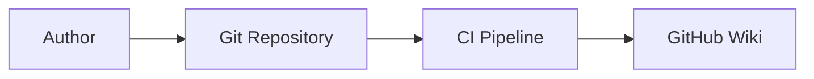

# doc-as-code-contract

# 📖 Docs-as-Code Contract

This document defines the **Docs-as-Code contract** for `awsctl`. It specifies how documentation is authored, published, and maintained as a first-class citizen of the system.

This document is authoritative.

---

## 🏗️ Core Assertion

Documentation for `awsctl` is **part of the system**, not commentary about it. If documentation is wrong, the system is wrong.

---

## 🎯 Why Docs-as-Code Exists

`awsctl` is a security-sensitive and audit-relevant tool. In such systems, unmanaged documentation becomes a technical liability. 

**Docs-as-Code ensures:**
* **Versioning:** Documentation matches the specific state of the code.
* **Reviewability:** Every change is vetted via Pull Requests.
* **Auditability:** A full history of architectural decisions is preserved.
* **Drift Detection:** Discrepancies between behavior and docs are treated as bugs.

---

## 🔍 Source of Truth

The **only authoritative source** for documentation is: `repository/docs/wiki/`.

The GitHub Wiki is a **published artifact**, not an authoring surface. Any manual edits made directly to the GitHub Wiki interface will be automatically overwritten by the CI pipeline.

---

## 🔄 Publication Model

Documentation follows a strict, unidirectional flow from source to publication.

### 🛰️ Documentation Flow (Mermaid)

---

## ✅ Standards and Requirements

### Documentation Quality
All documents must be explicit, deterministic, and free of speculative language. Words like "usually" or "should" are discouraged; behavior must be described with absolute clarity.

### Security-Specific Rules
Security documentation must declare **trust boundaries** and **non-goals** explicitly. If a security behavior is undocumented, it is considered unsafe.

### Diagram-as-Code

Screenshots of diagrams are **forbidden**. All diagrams must be:
* **Mermaid:** For conceptual and logic flows (inline).
* **AWS Diagram-as-Code:** For architecture (source in `diagrams-src/`).
* **Versioned:** Both source and rendered outputs must be checked into Git.

---

## 🚫 Forbidden Practices

The following are violations of the contract:
* **Direct Wiki Edits:** Modifying the published artifact instead of the source.
* **Orphaned Diagrams:** Publishing images without their corresponding source files.
* **Documentation Debt:** Leaving deprecated docs in place "for reference."
* **Shadow Systems:** Maintaining parallel documentation outside of the repository.

---

## ⚖️ Review and CI Enforcement

Documentation can **block a release**. During review, maintainers must verify that the documentation is accurate, complete, and does not weaken the security posture.

**CI enforces the following gates:**
* Markdown linting and naming consistency.
* Link integrity (no 404s).
* Diagram validity and source-to-artifact parity.

---

## 📝 Summary

`awsctl` documentation is code-adjacent, review-gated, and auditable. If documentation is allowed to drift, the system becomes unsafe. This contract exists to ensure that the "Root of Trust" is always clearly defined and verifiable.

> [!IMPORTANT]
> By contributing to `awsctl`, you agree to uphold this contract. Documentation debt is treated with the same severity as technical debt.