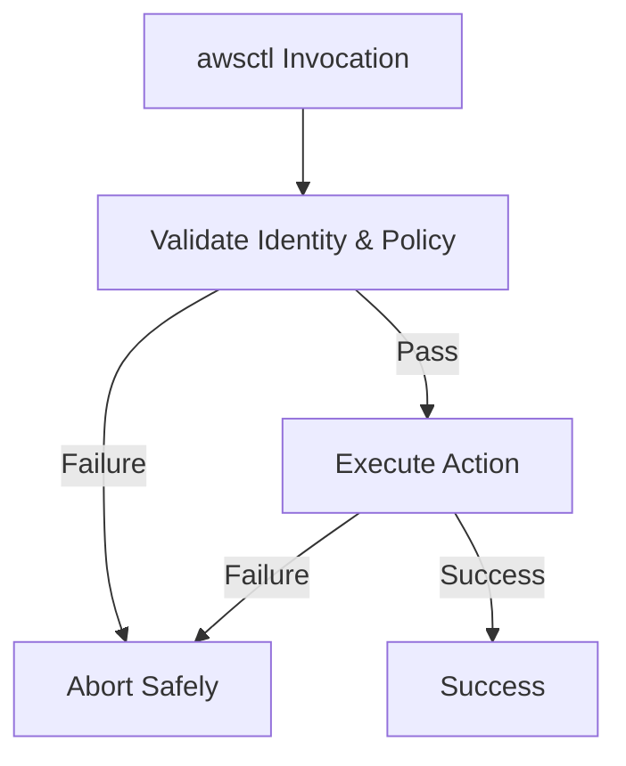

# 🛠️ Failure Modes & Mitigation

# ⚠️ Failure Modes and Mitigation

This document defines the **expected failure modes** of `awsctl` and how they are **intentionally handled**. In `awsctl`, failure is often the correct behavior; many failures are deliberate safety outcomes designed to prevent undefined or insecure states.

This document is authoritative.

---

## 🏛️ Core Principle

> **In `awsctl`, failure is often the correct behavior.**

`awsctl` is engineered to fail early, loudly, and safely, leaving absolutely no partial state. Silent success is considered more dangerous than an explicit failure.

---

## 🔍 Categories of Failure

### 1. Identity Failures
* **Examples:** User not authenticated with IdP, MFA not completed, expired SSO session.
* **Mitigation:** Execution aborts immediately. No credentials are issued.
* **Rationale:** `awsctl` never attempts to "recover" identity; authentication is strictly external.

### 2. Policy Failures (Registry / Guardrails)
* **Examples:** Account not allowlisted, role not permitted, region not allowed, invalid registry schema.
* **Mitigation:** Aborts before any AWS calls are made. No fallback behavior.
* **Rationale:** Policy failures represent intent mismatches. Continuing would violate organizational controls.

### 3. Environment Failures
* **Examples:** Unsupported shell, broken shell integration, invalid environment variables.
* **Mitigation:** Abort without modifying the environment. Diagnostic guidance provided via `awsctl doctor`.
* **Rationale:** Environment ambiguity creates security risk. `awsctl` refuses to guess.

### 4. Execution Failures (AWS)
* **Examples:** `STS AssumeRole` denied, permission boundary violation, service unavailable.
* **Mitigation:** No retries for authorization errors. Retries only for safe, transient API failures.
* **Rationale:** Authorization failures must be visible; retries cannot fix denied intent.

### 5. Integration Failures
* **Examples:** Plugin load/validation failure, output contract violation.
* **Mitigation:** Execution aborts. No partial plugin execution.
* **Rationale:** Extensions are untrusted. Failure must not degrade core safety.

---

## 🔄 Failure Handling Flow (Mermaid)

---

## 🛡️ Abort Semantics & Safety

When `awsctl` aborts, it guarantees a clean exit:
* **No environment mutation:** Environment variables remain untouched.
* **No credential caching:** No session tokens are saved to disk.
* **No background residue:** No processes or daemons remain active.

### 🚫 No Silent Fallbacks
`awsctl` explicitly forbids falling back to default AWS credentials, weaker policies, or skipping guardrails. Any fallback would create a "half-trusted" execution state, which is a security regression.

---

## 🚦 User-Initiated Aborts

User aborts (e.g., `Ctrl+C` or selecting "no" at a prompt) are treated as **valid intent**. They leave no residual state and are not logged as system errors, as choosing not to proceed is a safe and supported operation.

---

## ✅ Non-Negotiable Rules

The following anti-patterns are strictly forbidden:
* **Best-effort execution:** Never proceed with missing data.
* **Silent downgrade:** Never reduce security posture automatically.
* **Auto-fixing violations:** Never bypass a policy to "help" the user.
* **Masking AWS denials:** Authorization errors must always be surfaced.

> [!IMPORTANT]
> `awsctl` treats failure as a first-class outcome. If `awsctl` ever succeeds by ignoring a failure, it has violated its design.

---

## 📚 Related Documentation
* [[Security Overview|Security-Overview]]
* [[Trust and Security Boundaries|Trust-and-Security-Boundaries]]
* [[Registry and Policy Model|Registry-and-Policy-Model]]
* [[Interactive and UX Behaviour|Interactive-and-UX-Behaviour]]