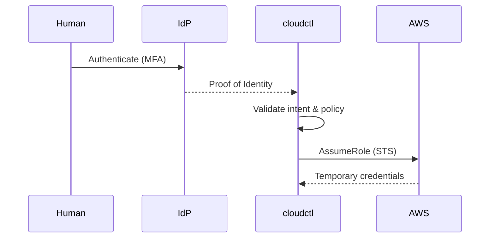

# identity-broker-pattern

# 🆔 Identity Broker Pattern

This document defines the **Identity Broker Pattern** as implemented by `cloudctl`. It explains what an identity broker is, what `cloudctl` brokers, why this pattern is safer than alternatives, and how it scales in large organizations.

This document is authoritative.

---

## 🏗️ Core Definition

An **identity broker** is a system that connects proven identity to existing authority in a controlled, auditable way.

**A broker strictly:**
* Does **not** authenticate users.
* Does **not** store credentials.
* **Does not** grant permissions or own authority.

`cloudctl` is an identity broker.

---

## 🎯 Why Identity Brokering Exists

In large AWS organizations, the challenge is not authentication, but **translation**. Organizations struggle to safely translate authenticated humans into *intended* AWS actions without falling into risks like static credentials or unreviewed privilege escalation.

`cloudctl` solves **translation**, not authentication. It ensures that when a human attempts to use their identity, the resulting AWS session is scoped, guarded, and intended.

---

## 🔍 What cloudctl Brokers (and Does Not Broker)

| cloudctl Brokers (Context) | cloudctl DOES NOT Broker (Authority) |
| :--- | :--- |
| **Proven Identity** (Who the human is) | **Authentication** (Passwords/MFA) |
| **Allowed Roles** (Registry constraints) | **Authorization** (IAM Policy definitions) |
| **Guardrails** (Conditions & Regions) | **Permissions** (What the role can do) |
| **Session Logic** (For how long) | **Trust Relationships** (IAM Role Trust) |

---

## 🔄 High-Level Identity Flow

`cloudctl` sits between proof and power, ensuring the handshake between the Identity Provider (IdP) and AWS STS is governed by organizational policy.

### 🛰️ Identity Brokerage (Mermaid)

---

## 🛡️ Why This Pattern Is Safer

* **Vs. Static Credentials:** No long-lived secrets, no credential sprawl, and automatic expiration.
* **Vs. Direct Role Switching:** Enforces guardrails, validates intent, and gates sensitive roles.
* **Vs. Custom Auth Systems:** No new trust roots, no duplicated security logic, and no shadow identity plane.

---

## 🌓 Identity vs. Authority Separation

`cloudctl` enforces a strict separation of concerns. Breaking this separation creates systemic risk.

| Concern | Owner |
| :--- | :--- |
| **Authentication** | Identity Provider (IdP) |
| **Authorization** | AWS IAM |
| **Intent Validation** | `cloudctl` |
| **Execution** | AWS STS |

### 🏗️ Identity Broker Boundary (Diagram-as-Code)

*`cloudctl` never becomes a trust anchor; it is a pass-through validator.*

---

## ✅ Broker Constraints (Non-Negotiable)

To maintain the security posture, an identity broker must:
1.  **Be stateless:** No local database of users or roles.
2.  **Be ephemeral:** Exists only for the duration of the request.
3.  **Fail closed:** If brokering fails, no credentials are issued.
4.  **Leave audit trails intact:** Native AWS and IdP logs must remain the source of truth.
5.  **Be removable:** Deleting `cloudctl` must not break the underlying security model.

---

## 📈 Scaling the Pattern

This pattern scales horizontally because:
* **External Identity:** Identity management remains with the enterprise IdP.
* **External Authority:** Permissions remain in AWS IAM.
* **Local Logic:** Broker logic runs on the operator's workstation, removing central bottlenecks.
* **Declarative Policy:** All guardrails are defined in a version-controlled registry.

---

## ⚖️ Summary

The Identity Broker Pattern is powerful because it is limited. `cloudctl` brokers identity just enough to make access safe, and no more. If `cloudctl` ever becomes an authentication system or a source of authority, it has violated this pattern.
