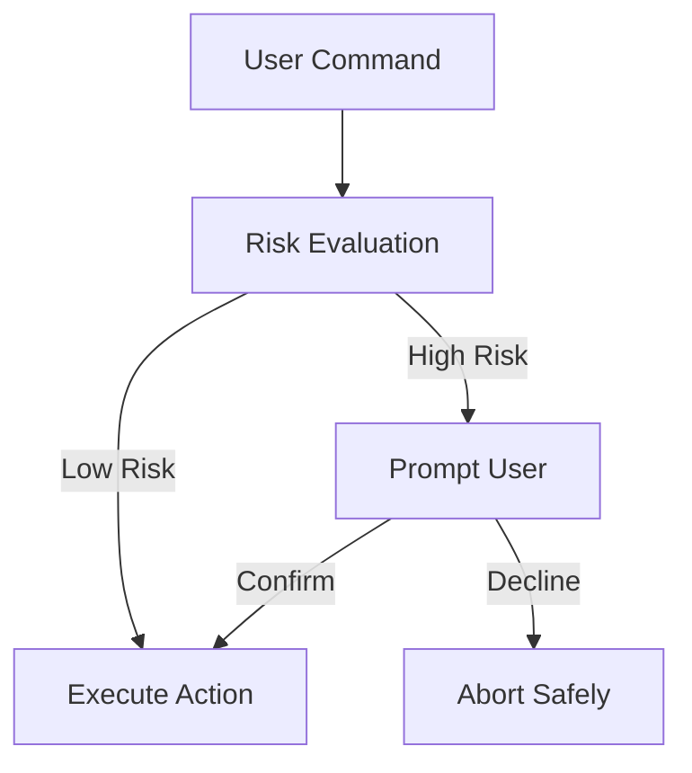

# interactive-and-ux-behaviour.md

# 🎭 Interactive and UX Behaviour

This document defines the **interactive behavior and user experience (UX)** of `awsctl`. `awsctl` is not a traditional CLI optimized for speed or brevity; it is a **safety-oriented operator tool** where UX choices function as security controls.

This document is authoritative.

---

## 🏗️ UX Design Philosophy

`awsctl` is designed for **deliberate use**, not muscle memory. Its UX optimizes for correctness over speed and safety over convenience.

* **Human-in-the-Loop:** `awsctl` assumes humans make mistakes and that automation amplifies them. Interactive prompts are a core security feature.
* **Visibility:** Guardrails must be visible and friction must be present during high-risk transitions.
* **Clarity:** Use of plain language and clear symbols (⚠️, ✅, ❌) ensures security-critical messages are never misinterpreted.

---

## ⚙️ Execution Modes

`awsctl` supports two distinct execution modes to balance operator safety with automation needs.

### 1. Interactive Mode (Default)
The standard mode for human operators.
* **Behavior:** Prompts for confirmation, requires explicit acknowledgment, and provides contextual warnings.
* **Usage:** Mandatory for switching accounts, assuming sensitive roles, or modifying execution context.

### 2. Non-Interactive Mode
Explicitly requested for scripts and pipelines.
* **Behavior:** Requires specific flags or environment configuration. Sensitive actions may be blocked unless explicit justifications are provided.
* **Usage:** Never implicit; automation must be intentional.

---

## 🚦 Prompting and Decision Flow

`awsctl` prompts are reserved for elevated risk or ambiguous intent. Read-only or low-risk deterministic actions do not trigger prompts.

### 🔄 Interactive Decision Flow (Mermaid)

### Sensitive Action Confirmation
Assuming roles like `AdministratorAccess` triggers a mandatory gate:
> ⚠️ **You are about to assume a sensitive role: AdministratorAccess**
> This action will be logged for audit purposes.
>
> **Proceed? (yes/no):**

---

## 🛡️ UX as a Guardrail

UX elements are part of the control system, serving as **soft guardrails**:
* **Warning Language:** Intentionally slows the user down.
* **Abort Semantics:** User aborts (Ctrl+C or "no" responses) leave **zero partial state** and cache no credentials.
* **Consistency:** Stable wording and predictable behavior across versions ensure the operator knows exactly what a prompt signifies.

---

## ❌ UX Anti-Patterns (Forbidden)

To maintain the security posture, `awsctl` must never:
* Auto-confirm sensitive actions or hide warnings behind flags.
* Change execution context silently.
* Use humor or ambiguous language in security warnings.
* Optimize prompts away for the sake of "frictionless" experience.

---

## 📝 Summary

The UX of `awsctl` is intentionally conservative to make risk visible and preserve intent clarity. If `awsctl` ever feels frictionless during dangerous operations, the UX has failed to protect the operator and the organization.