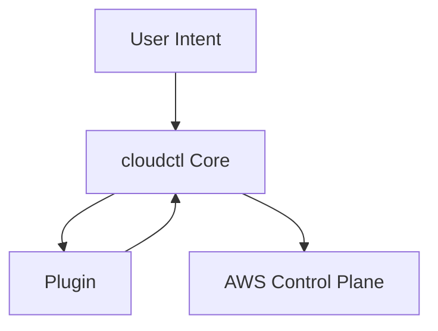
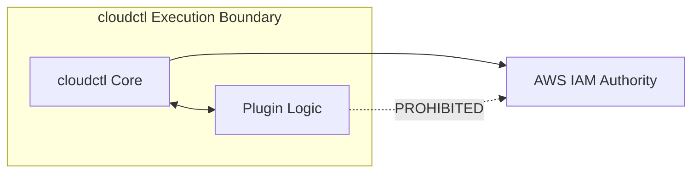

# plugin-framework.md

# 🔌 Plugin Framework

This document defines the **plugin framework** used by `cloudctl`. It explains why plugins exist, what they are allowed to do, what they are explicitly forbidden from doing, and how safety is enforced during execution.

This document is authoritative.

---

## 🏗️ Core Assertion

Plugins extend **behavior**, not **authority**. 

If a plugin can increase privileges, bypass guardrails, or persist trust, it is a security defect.

---

## 🎯 Why Plugins Exist

`cloudctl` is intentionally conservative at its core. Plugins exist to allow organizations to:
* **Integrate Identity Providers:** Custom handshakes for Okta, Entra ID, etc.
* **Enforce Custom Validations:** Business-specific logic for session requests.
* **Add Contextual Checks:** Verification of ticket numbers or environment health.
* **Adapt Local Workflows:** Tailoring ergonomics without forking the core binary.

---

## 🏛️ Plugin Design Goals

* **Preserve Trust:** Never bypass established boundaries.
* **Isolation:** Third-party logic must be sandboxed.
* **Fail Safely:** Plugin errors must result in a safe abort.
* **Auditability:** Every plugin action must be traceable.

---

## 🌓 Plugin Architecture & Trust

Plugins are treated as **untrusted, optional, and non-authoritative**. They operate entirely within the `cloudctl` execution boundary.

### 🔄 Plugin Execution Model (Mermaid)

### 🧱 Plugin Boundary (Diagram-as-Code)

*Plugins are logically adjacent to the core but never gain direct authority.*

---

## ✅ Allowed vs. 🚫 Prohibited Actions

| Category | Allowed Capabilities | Explicit Prohibitions |
| :--- | :--- | :--- |
| **AWS Interaction** | Inspecting context (Account/Role) | **Calling AWS APIs directly** |
| **Credentials** | Requesting MFA via Core | **Generating or storing credentials** |
| **System** | Emitting warnings/errors | **Spawning background processes** |
| **Storage** | Reading registry data | **Writing to disk (outside temp space)** |
| **Authority** | Enforcing additional constraints | **Bypassing registry enforcement** |

---

## ⚙️ Lifecycle and Discovery

### Plugin Hooks
Plugins hook into defined, synchronous phases:
1. **Pre-validation:** Check inputs before processing.
2. **Post-registry evaluation:** Validate intent against specific rules.
3. **Pre-execution:** Final gate before AWS STS calls.
4. **Post-execution:** Read-only metadata enrichment (no credential access).

### Discovery and Loading
* **Deterministic:** Load order is fixed and defined in configuration.
* **Fail-Closed:** Failure to load or configure a plugin results in an immediate **hard failure**.
* **Stateless:** No dynamic downloading or runtime updates are supported.

---

## 🔐 Isolation and Security

Isolation is enforced by providing plugins with limited, read-only interfaces. Plugins **do not** receive:
* `boto3` or `aws-sdk` clients.
* Active STS credentials.
* Direct shell access.

### 🚦 Error Handling
Plugin errors result in an **immediate execution abort**. Plugins cannot catch or suppress fatal errors generated by `cloudctl` Core.

---

## 📝 Summary

The `cloudctl` plugin framework enables controlled extensibility without compromising security. Plugins are powerful because they are constrained; they adapt `cloudctl` to enterprise realities without becoming new sources of risk.
