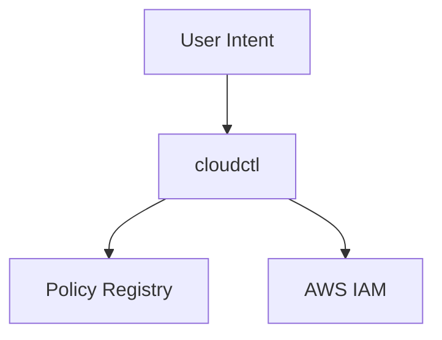

# registry-and-policy-model.md

# 📋 Registry and Policy Model

This document defines the **registry and policy model** used by `cloudctl`. It explains what the registry is, what it is allowed to express, what it is explicitly forbidden from doing, and how policy is enforced at runtime.

This document is authoritative.

---

## 🏗️ Core Assertion

The `cloudctl` registry defines **allowed intent**, not authority. It is a **policy constraint layer**, not a permission system.

---

## 🎯 Why a Registry Exists

In large AWS organizations:
* **IAM** defines *what is possible*.
* **Humans** define *what is intended*.
* **Drift** happens between the two.

`cloudctl` exists to close that gap **without changing IAM**. The registry allows organizations to declare: *"Even if IAM allows this, we do not."*


---

## 🔍 Registry Characteristics

The registry is:
* **Declarative:** Defines the desired state of intent.
* **Static:** Fixed at execution time; no dynamic shifts.
* **Human-Reviewable:** Stored in readable formats (YAML).
* **Version-Controlled:** Managed via Git for a clear audit trail.
* **Read-Only:** The `cloudctl` binary never modifies the registry.

**The registry is NOT:** A credential store, a role vending system, or a source of authority. Any attempt to make it one is a design violation.

---

## 📥 Registry Inputs

The registry defines explicit constraints. **No wildcards** are permitted for sensitive dimensions.

**Inputs include:**
* Allowed AWS accounts and IAM roles.
* Sensitive role classifications (requiring extra hurdles).
* Region allowlists.
* Guardrail toggles and feature flags.

### Example Registry Concept (Illustrative)

```yaml
accounts:
  - id: "123456789012"
    name: "prod"
    roles:
      - name: "AdministratorAccess"
        sensitive: true
      - name: "ReadOnlyAccess"
        sensitive: false

regions:
  allowed:
    - us-east-1
    - eu-west-1

features:
  interactive_confirmations: true
```
> **Note:** This does not grant access; it limits it.

---

## ⚙️ Policy Evaluation Flow

`cloudctl` enforces registry constraints **before** AWS is contacted.


### 🔄 Policy Enforcement (Mermaid)



### Evaluation Semantics
1. **Deterministic:** Same input always yields the same policy result.
2. **Fail-Fast:** No AWS calls are made if registry evaluation fails.
3. **Sensitive Roles:** Roles marked as sensitive require explicit confirmation and justification.

---

## ⚖️ Guardrails vs. IAM

| Aspect | IAM | Registry |
| :--- | :--- | :--- |
| **Authority** | Yes | No |
| **Enforcement** | AWS | `cloudctl` |
| **Scope** | Global | Execution-time |
| **Audit Source** | CloudTrail | CloudTrail + CLI logs |

---

## ✅ Validation and Change Control

* **Validation:** Before use, the registry is validated for schema correctness and internal consistency. Invalid registry data results in a **hard failure**.
* **No Fallbacks:** `cloudctl` does not guess or bypass if data is missing. Failure is intentional.
* **GitOps:** Changes are reviewed via Git and applied explicitly. There is no dynamic reload during an active session.

---

## 🚫 Anti-Patterns (Explicitly Forbidden)

The following are strictly prohibited as they break the trust model:
* **Dynamic Mutation:** No runtime changes to registry state.
* **Auto-Expansion:** No "learning" mode for allowlists.
* **Silent Downgrade:** `cloudctl` must never move to a weaker policy state without explicit operator action.

---

## 📝 Summary

The `cloudctl` registry model works because IAM defines authority while humans define intent. `cloudctl` acts as the enforcer for that intent. The registry is powerful precisely because it is limited.

Would you like me to generate a JSON Schema to validate your current registry YAML files?