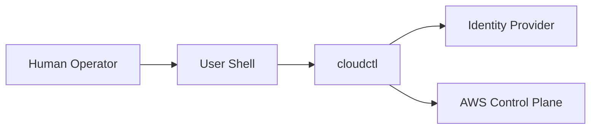

# security-overview.md

# 🛡️ Security Overview

This document provides a **high-level security overview** of `cloudctl`. It is intended for Security Engineers, Platform Owners, Auditors, and Risk Reviewers.

Detailed threat analysis and boundary definitions are covered in companion documents. This page defines the **security posture at a glance**.

---

## 🏗️ Executive Summary

`cloudctl` is a client-side identity orchestration tool designed to interact with AWS securely without introducing new control planes, long-lived credentials, or implicit authority.

Its security model is built on five core properties:
* **Authority remains with AWS**
* **Identity is brokered, not owned**
* **Credentials are ephemeral**
* **Execution is local and deterministic**
* **Auditing uses native AWS systems**

If `cloudctl` is removed, the organization remains secure and functional.

---

## 🔎 What cloudctl Is (Security Perspective)

**cloudctl is:**
* A policy-enforcing client
* An identity broker
* A context selector
* A guardrail enforcement layer

**cloudctl is NOT:**
* An authentication system
* A credential store
* A control-plane service
* A background agent
* An authorization authority

---

## 🎯 Core Security Goals

`cloudctl` is designed to:
* **Reduce blast radius** of human access.
* Make access **explicit and reviewable**.
* **Eliminate long-lived credentials**.
* Prevent accidental privilege escalation.
* Preserve **CloudTrail** as the source of truth.

---

## 🗺️ High-Level Security Architecture

### 🔄 Security at a Glance (Mermaid)

`cloudctl` sits between intent and execution, enforcing policy at runtime.

---

## 🆔 Identity & Authentication

### Identity Source
`cloudctl` relies on external systems for authentication:
* **AWS IAM Identity Center**
* **External IdPs** (e.g. Okta, Entra ID)

### Security Properties
* **MFA:** Enforced outside `cloudctl` at the IdP level.
* **Secrets:** No passwords or authentication secrets are handled or stored by `cloudctl`.
* **Consumption:** `cloudctl` only consumes proof of identity, never the credentials themselves.

---

## ⚖️ Authorization Model

Authorization is defined entirely by AWS native controls:
* **IAM Policies:** Trust policies and role permissions.
* **Boundaries:** Mandatory permission boundaries.
* **SCPs / RCPs:** Organization-level Service Control Policies.

`cloudctl` does not grant permissions. It only selects from what already exists within the AWS control plane.

---

## 🔑 Credential Handling

### Credential Characteristics
All AWS credentials used by `cloudctl` are:
* **Short-lived:** Time-bound TTL.
* **STS-issued:** Generated by the Security Token Service.
* **Process-scoped:** Limited to the active session.
* **Memory-resident:** Not persisted to disk.

### Explicit Guarantees
`cloudctl` will never generate access keys, store credentials on disk, or share credentials between processes.

---

## ⚙️ Execution & Enforcement

### Execution Model
`cloudctl` executes in a single-invocation, ephemeral context. This ensures no background agents, no hidden state, and clear forensic traceability.

### Guardrails
Policy is enforced at the moment of execution, including:
* Allowed accounts/roles lists.
* Sensitive role handling.
* Region restrictions.
* Minimum client version requirements.

---

## 🐚 Shell & Plugin Security

### Shell Integration
The highest-risk surface area is secured by:
* **One-way output:** `cloudctl` → shell.
* **Validation:** Strict character allow-lists for output.
* **No execution:** `cloudctl` never executes shell commands directly.

### Plugins
Treated as untrusted code:
* **Isolated context:** No direct credential access.
* **Failure isolation:** Plugin errors trigger safe aborts.

---

## 🧾 Audit & Failure Philosophy

### Audit & Logging
`cloudctl` relies on native audit systems:
* **AWS CloudTrail:** For all API activity.
* **IdP Logs:** For authentication events.
* **Local Logs:** Structured output for local traceability.

### Failure Mode
`cloudctl` fails closed, loudly, and visibly. Ambiguity, partial success, or silent fallbacks are treated as failures.

---

## ✅ Security Invariants

The following must always remain true:
1.  `cloudctl` holds no long-lived secrets.
2.  Authority remains with AWS.
3.  Execution is ephemeral.
4.  Trust boundaries are explicit.
5.  Audit trails are preserved.

> [!IMPORTANT]
> `cloudctl` is secure not because it is powerful, but because it refuses to become powerful.