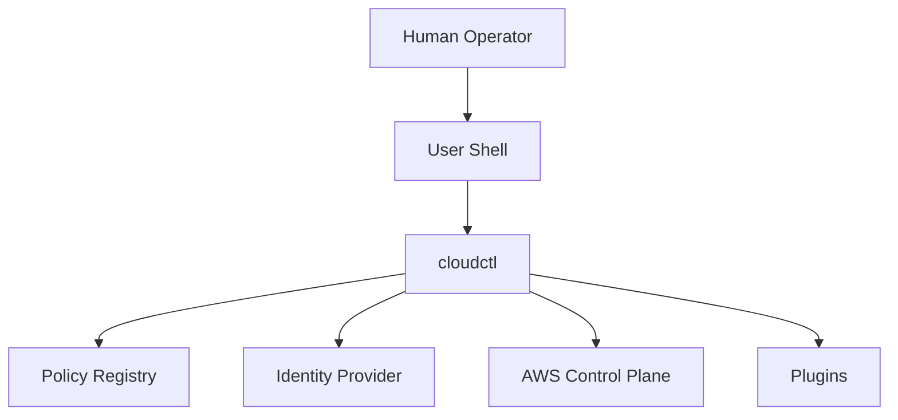
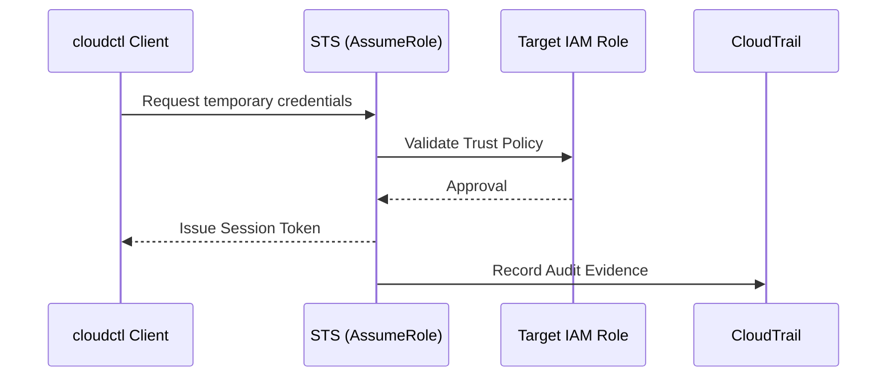

# security-trust-model.md

# 🛡️ Security Trust Model

This document defines the **explicit trust model** of `cloudctl`. It answers three questions unambiguously:

1. Who does `cloudctl` trust?
2. What authority is delegated?
3. What is explicitly *not* trusted?

This document is authoritative.

---

## 🏗️ Core Assertion

`cloudctl` is a **trust consumer**, not a trust authority. 

It does not create trust, extend trust, or centralize trust. It only **selects, validates, and enforces** trust that already exists within your identity and infrastructure providers.

---

## 🎯 Trust Model Goals

The `cloudctl` trust model is designed to:
* **Minimize implicit trust:** Every action requires explicit validation.
* **Localize authority:** Authority remains at the source (AWS/IdP).
* **Preserve native AWS auditability:** Actions must be visible in CloudTrail.
* **Prevent lateral movement:** Scoped credentials prevent "hopping" between accounts.
* **Fail safely and visibly:** Ambiguity results in an immediate halt.

---

## 👥 Trust Actors

The `cloudctl` ecosystem consists of distinct actors with specific authorities and constraints:

* **Human Operator:** The source of intent and MFA completion.
* **Local Workstation:** The execution environment (assumed non-hostile but non-sterile).
* **User Shell:** The interface (treated as injection-prone and mutable).
* **cloudctl Binary:** The stateless broker that enforces guardrails.
* **Identity Provider (IdP):** The proof of identity (Okta, Entra ID, etc.).
* **AWS Control Plane:** The final authority on authorization.
* **Policy Registry:** The definition of allowed intent.
* **Plugins:** Constrained, untrusted extensions.

---

## 🗺️ High-Level Trust Graph

### 🔄 Trust Relationships (Mermaid)

*Arrows represent directional trust consumption, not control.*

---

## 🧱 Actor Constraints & Responsibilities

### 👤 Human Operator
* **Trusted:** User intent, interactive confirmation, MFA completion.
* **Untrusted:** Perfect judgment or error-free operation.

### 💻 Local Workstation & Shell
* **Workstation:** Trusted for process isolation; untrusted for installed software.
* **Shell:** Trusted only to invoke `cloudctl` and evaluate output. `cloudctl` **never** trusts shell state (env vars) as authoritative input.

### ⚙️ cloudctl Binary
* **Responsibilities:** Validate input, enforce guardrails, broker identity.
* **Limits:** Must never store credentials, persist authority, or run background processes.

---

## ☁️ AWS Control Plane Trust

AWS is the ultimate authority. `cloudctl` defers all authorization decisions to AWS native controls: **IAM Policies, Permission Boundaries, and SCPs.**

### 🔄 AWS Trust Relationship (Diagram-as-Code)

---

## 🧩 Extensions & Data Trust

### 🗂️ Policy Registry
The registry defines allowed intent (e.g., account allowlists), not authority. It cannot grant permissions or vend credentials. Registry data is validated before use; malformed data triggers a **fail-closed** response.

### 🔌 Plugin Trust Model
Plugins are **untrusted extensions**. They execute under `cloudctl`’s authority, never above it.
* **Cannot:** Escalate privileges, bypass guardrails, or access raw credentials.
* **Can:** Inspect context and enrich metadata.

---

## ⚖️ Failure & Audit Semantics

* **Trust Downgrade Prevention:** `cloudctl` prevents policy shadowing or silent fallback to weaker trust sources.
* **Failure Mode:** Any ambiguity or incomplete trust results in an immediate **abort**. There is no “best effort” mode.
* **Evidence:** Trust decisions are evidenced via native **CloudTrail** and **IdP logs**.

---

## ✅ Non-Negotiable Trust Invariants

1. **Authority lives outside cloudctl.**
2. **Identity is proven, not cached.**
3. **Trust is explicit.**
4. **Failure is visible.**
5. **Execution is ephemeral.**

> [!IMPORTANT]
> If `cloudctl` ever becomes a “source of truth” for trust rather than a broker, it has violated its design.
