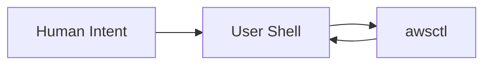
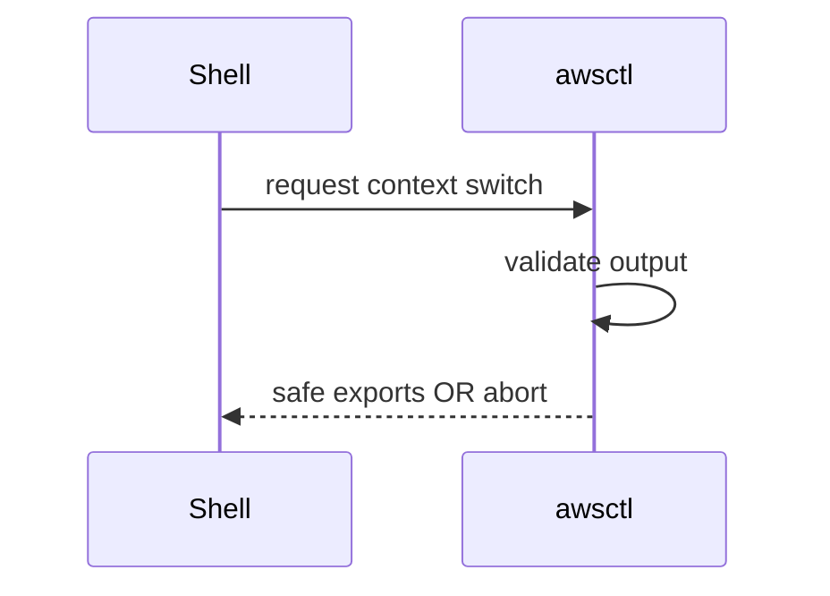

# shell-integration.md

# 🐚 Shell Integration

This document describes how `awsctl` integrates with the user’s shell. Shell integration is **intentional**, **constrained**, and **security-critical**. It exists to improve ergonomics **without expanding authority**.

This document is authoritative.

---

## 🎯 Why Shell Integration Exists

`awsctl` is a client-side tool designed to manage **execution context**, not credentials. To be usable in day-to-day workflows, `awsctl` must manage environment transitions smoothly while preserving shell session continuity and avoiding "subshell traps" where environment changes are lost.

Shell integration enables this **without running a daemon** and without persisting state to the disk.

---

## 🏗️ Core Principle

> `awsctl` integrates with the shell **only by emitting controlled output**. It never executes shell code itself.

This single rule governs all shell behavior. `awsctl` functions as a generator of shell-compatible text that the parent shell then chooses to act upon.

---

## 🧱 The Shell as a Trust Boundary

The shell is treated as a mutable, potentially hostile environment outside `awsctl`’s trust domain. `awsctl` **never trusts shell state blindly** and never assumes a clean environment.


### 🔄 Shell Boundary (Mermaid)



All communication is explicit and unidirectional per step.

---

## ⚙️ Execution Strategies

`awsctl` supports multiple execution strategies depending on the shell and command context.

### 1. exec Strategy (Default)
`awsctl` prints shell-safe exports which the shell evaluates explicitly. This is the most transparent method as there is no hidden execution.

**Example:**
```bash
eval "$(awsctl switch)"
```

### 2. eval Strategy (Shell Wrapper)
When using the provided shell integration script, a wrapper (e.g., an alias or function) captures the output and performs validation before applying exports. The `awsctl` binary itself remains unaware of the evaluation.

### 3. No-Op Strategy
For read-only commands like `status`, `list`, or `doctor`, no environment mutation occurs. These commands output informational text to `stdout` or `stderr` without shell directives.

---

## 📜 Output Contract

To prevent accidental execution or injection, `awsctl` enforces a strict output contract. It will **only** output:

* `export KEY=value` statements.
* Structured informational messages (via `stderr`).
* Standard exit codes.

**It will NEVER output:**
* Arbitrary shell code.
* Command substitutions (e.g., `$(...)`).
* Backticks, pipes, or redirections.

---

## 🔐 Shell Injection Protections

`awsctl` actively defends against shell injection through several layers of validation:

* **Strict Allow-lists:** Only known safe characters are permitted in values.
* **Quoting Enforcement:** All exported values are wrapped in single quotes to prevent expansion.
* **Hard Failure:** If an output cannot be rendered safely, the process aborts immediately rather than emitting malformed or "best-effort" code.

### 🔄 Injection Prevention (Mermaid)



---

## 🐚 Supported Shells

`awsctl` is designed to be shell-agnostic at its core, with specific behavior isolated to lightweight wrapper scripts for:

* **bash** — wrapper injected into `.bashrc` / `.bash_profile` / `.profile`
* **zsh** — wrapper injected into `.zshrc`
* **PowerShell (pwsh / Windows PS)** — function injected into `$PROFILE` (cross-platform)
* **fish** — function written to `~/.config/fish/functions/awsctl.fish`

### Manual Installation (Optional)
Shell integration is strictly opt-in. To enable the wrapper:

```bash
source <(awsctl shell init)
```

## 🪟 PowerShell Integration

For Windows-native use (or cross-platform `pwsh`), `awsctl init` injects a function into your PowerShell `$PROFILE`. The function:

1. Detects mutating commands (`switch`, `use`, `logout`, or `login` with account/role flags).
2. Runs `_awsctl_bin --eval <args>` and captures output to a temp file.
3. Parses `export K=V` lines and applies them via `Set-Item env:` / `[System.Environment]::SetEnvironmentVariable`.
4. Passes all other commands through directly to the binary.

**Manual install:**
```powershell
awsctl init   # detects PowerShell automatically
```

## 🐟 Fish Integration

`awsctl init` writes `~/.config/fish/functions/awsctl.fish`. Fish's autoload mechanism picks it up with no further configuration.

**Manual install:**
```fish
awsctl init
```

---

## 🚫 What awsctl Will Never Do

* **Modify Dotfiles:** It will never automatically edit `.bashrc`, `.zshrc`, or other profile scripts.
* **Execute Commands:** It will never spawn subprocesses in your shell.
* **Persistent Daemons:** It will never leave background processes running.
* **Override Aliases:** It will never silence user errors or override existing aliases without consent.

---

## ⚖️ Summary

Shell integration in `awsctl` is **explicit, minimal, and reviewable**. It exists to enable humans to work efficiently without compromising trust boundaries. If shell integration ever feels “magical” or “automatic,” it has violated this design.
