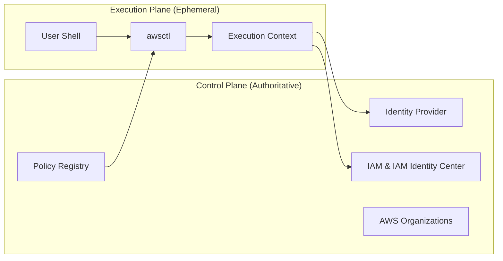

# split-plane-architecture.md

# 🛡️ Split-Plane Architecture

This document defines the **Split-Plane Architecture** of `awsctl`. It explains **what runs where**, **what is trusted**, and **why awsctl is intentionally not a control-plane system**.

This document is authoritative.

---

## Architectural Thesis

`awsctl` is built on a **split-plane model**:

* **Control Plane:** Defines policy, trust, and authority.
* **Execution Plane:** Performs user-scoped actions safely.

`awsctl` **does not own** the control plane. It **operates within** it. This separation is the foundation of `awsctl`’s security, safety, and auditability.

---

## 🏗️ The Two Planes

### Control Plane (Authoritative)
The control plane consists of systems that define **who is allowed to do what**. These systems exist before `awsctl` and remain authoritative without it.

**Components:**
* AWS IAM & IAM Identity Center
* External Identity Providers (e.g., Okta)
* AWS Organizations
* Guardrail registries and configuration

### Execution Plane (Ephemeral)
The execution plane is **local, user-scoped, and transient**. It does not persist authority and exists only for the duration of a single invocation.

**Components:**
* The user’s shell and the `awsctl` binary
* Short-lived STS credentials
* In-memory execution context

---

## 🔄 Split-Plane Overview (Mermaid)

---

## ⚖️ Responsibility Mapping

| Feature | Control Plane (Authoritative) | Execution Plane (Ephemeral) |
| :--- | :--- | :--- |
| **Identity** | Identity proofing & Trust | Context selection |
| **Permissions** | Boundaries & Org Policies | Credential vending (STS) |
| **Enforcement** | Account/Role definitions | Guardrail & UX logic |
| **Failure** | Refuses execution | Aborts safely |

---

## 🚫 Why awsctl Is Not a Control Plane

`awsctl` intentionally avoids becoming a control plane to prevent:
* **Accumulated Authority:** Control planes often harbor "hidden" or long-lived power.
* **Invisible Drift:** Changes in a central plane can be hard to track per user.
* **Audit Gaps:** Local execution ensures intent is explicit and tied to a human actor.

---

## 🐚 Shell as a Boundary, Not a Plane

The shell is the boundary between human intent and execution. `awsctl` treats the shell as **potentially hostile** and **non-deterministic**. Rather than implicitly mutating the environment, `awsctl` uses explicit execution strategies to pass data across this boundary safely.

---

## 🛡️ Security Implications

This architecture ensures:
1.  **No hidden authority:** All power is derived from explicit AWS roles.
2.  **No long-lived credentials:** Access expires automatically.
3.  **No background services:** If the binary isn't running, it isn't doing anything.
4.  **Native AWS audit trails:** Every action is captured by CloudTrail.

---

## ✅ Non-Negotiable Design Rules

Any change that blurs these planes is an architectural regression. The following rules must always hold:
* `awsctl` must remain client-side.
* The Control Plane must remain external.
* Execution must be ephemeral and authority must be explicit.
* Failure must be safe by default.

> [!IMPORTANT]
> `awsctl` is not powerful because it controls AWS. **`awsctl` is powerful because it refuses to.**
