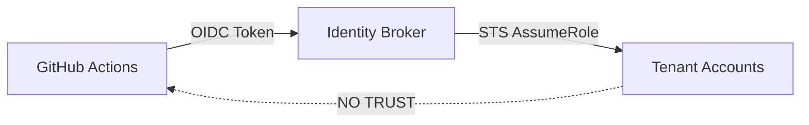

# threat-model

# 🛑 Threat Model: Identity Armor

This document defines the **explicit threat assumptions**, **attack surfaces**, and **defensive posture** of the Identity Armor bootstrap system. It serves as the authoritative security reference for the project.

---

## 📋 Threat Assumptions

The design of Identity Armor is predicated on an **"Assume Breach"** mentality. We operate under the following assumptions:

* **Hostile CI Environment:** GitHub Actions runners are treated as ephemeral and potentially compromised.
* **Repository Vulnerability:** Individual repositories may be subject to malicious Pull Requests or compromised contributor accounts.
* **Token Exfiltration:** Short-lived OIDC tokens may be intercepted during transit or leaked through logs if not handled strictly.
* **Human Error:** Configuration drift and accidental misconfigurations are more frequent risks than targeted internal malice.

---

## 🕵️ Primary Threats and Mitigations

The system is engineered to mitigate specific high-impact threats through structural controls rather than manual oversight.

| Threat | Description | Mitigation Strategy |
| :--- | :--- | :--- |
| **Unauthorized Role Assumption** | A malicious or misconfigured repo attempts to gain access to a tenant. | **OIDC Claim Validation:** AWS IAM verifies the `sub` (subject) and `repo` claims before granting trust. |
| **Lateral Movement** | Access to one tenant (spoke) is used to hop into another. | **Isolation by Design:** Spoke accounts never trust each other; trust is strictly hub-and-spoke. |
| **Privilege Escalation** | An assumed role is modified to grant `AdministratorAccess`. | **Permission Boundaries:** Hard logical ceilings that restrict the maximum possible authority of any role. |
| **Audit Evasion** | Actions are taken that cannot be traced back to a specific human or repo. | **Mandatory Attribution:** CloudTrail logs are enriched with immutable GitHub OIDC claims (Actor, Run ID). |
| **Configuration Drift** | Manual "ClickOps" changes introduce security holes. | **Idempotent Reconciliation:** The bootstrap overwrites manual drift to restore the version-controlled baseline. |

---

## 🏗️ Attack Surface Analysis

### 1. The Identity Broker (Identity Hub)
The Broker is the most sensitive component as it handles the initial OIDC handshake.
* **Defense:** The Broker role is restricted by a policy that *only* allows assuming specific roles in spoke accounts if the GitHub repository matches the explicit allowlist.

### 2. Tenant Spoke Accounts
The targets of the bootstrap process.
* **Defense:** These accounts contain no long-lived IAM Users. All access is brokered through the Hub using temporary, session-based STS credentials.

### 3. GitHub OIDC Provider
The source of external identity.
* **Defense:** Identity Armor uses thumbprint verification to ensure it only talks to the official GitHub OIDC endpoint, preventing Man-in-the-Middle (MITM) attacks.

---

## 🧭 Trust Boundary Summary

Trust is strictly unidirectional. Spoke accounts are "blind" to the existence of GitHub; they only recognize and trust the Identity Hub.

---

## 🚫 Non-Goals: What We Do Not Defend Against

The following threats are outside the scope of this tool and must be addressed by organizational security policies:

* **Compromised GitHub Org Admin:** If an attacker gains Org Admin rights in GitHub, they can modify the source repository or OIDC claims.
* **AWS Root User Abuse:** Access via the AWS Account Root User bypasses all IAM controls and Permission Boundaries.
* **Malicious Insider with "Break-Glass" Access:** Emergency access paths are logged but technically bypass the automated broker.

---

## ⚖️ Security Invariants

The following invariants must **never** be violated. Any Pull Request that breaks these will be rejected:

1.  **No Static Credentials:** No IAM Users or Access Keys may be created.
2.  **No Direct Spoke Trust:** Spoke accounts must never trust GitHub directly.
3.  **Mandatory Boundaries:** No IAM Role may be created without an attached Permission Boundary.
4.  **Fail Closed:** Any failure in OIDC validation or configuration parsing must result in an immediate halt.

---

> [!IMPORTANT]
> This threat model is updated as new capabilities are added to the roadmap. If you discover a potential bypass, please refer to the **Security Disclosure Policy**.