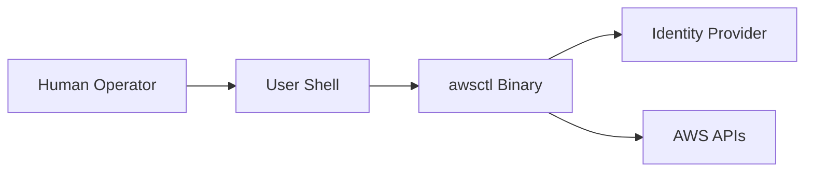
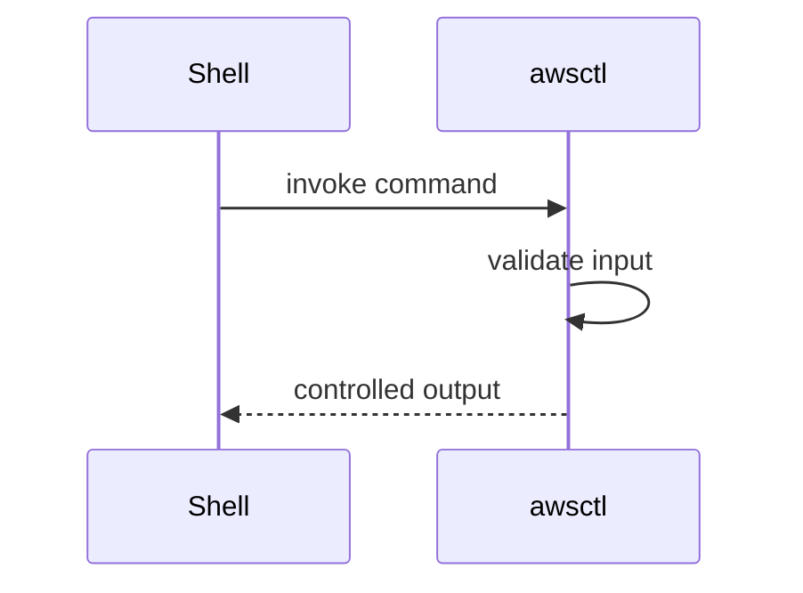

# Trust-and-Security-Boundaries.md

# 🛡️ Trust and Security Boundaries

This document defines the **explicit trust boundaries** and **security model** of `awsctl`. It explains **what awsctl trusts**, **what it does not**, and **why those decisions exist**.

This document is authoritative.

---

## 🏗️ Core Security Posture

`awsctl` is a **client-side identity orchestration tool**, not a control-plane service. Its security model is built on the principle that the client should be a transparent, policy-enforcing broker rather than a source of authority.

**Security Pillars:**
* **Explicit Trust Boundaries:** Every data transition is a gated event.
* **Least Privilege by Construction:** Operations are limited to the specific task at hand.
* **Ephemeral Credentials Only:** No static keys; all access is time-bound.
* **Deterministic Execution:** Identical inputs yield identical security outcomes.
* **Native Auditability:** Relies on AWS CloudTrail for the ultimate source of truth.

`awsctl` does **not** introduce new trust relationships. It only consumes and enforces existing ones defined in AWS and your Identity Provider.

---

## 🗺️ High-Level Trust Boundary Overview

### 🔄 End-to-End Trust Boundaries (Mermaid)

---

## 🧱 Boundary 1: Human Operator → Local Machine

### Trust Assumption
* The operator has authenticated access to their workstation.
* OS-level security (disk encryption, user isolation) is enforced outside of `awsctl`.

### awsctl Guarantees
* **Zero Persistence:** No credentials or session tokens are stored in long-term files.
* **No Daemons:** No background processes that could be hijacked.
* **No Escalation:** `awsctl` runs with user-level permissions and never requests `sudo`.

---

## 🐚 Boundary 2: Shell → awsctl

### Why This Boundary Exists
`awsctl` integrates with the shell to provide environment variable exports and context switching. Because the shell is a highly dynamic environment, it represents a significant risk vector.

### Security Controls
* **Controlled Execution:** Uses safe `exec` and `eval` patterns.
* **Injection Prevention:** Strict validation of input characters to prevent shell command injection.
* **Input Validation:** `awsctl` verifies all flags and arguments before processing.

---

## 🆔 Boundary 3: awsctl → Identity Provider

`awsctl` acts as a broker, not an authenticator. It facilitates the handshake between the user and providers like AWS IAM Identity Center or Okta.

### Trust Characteristics
* **External Auth:** Authentication occurs in the browser or IdP-controlled prompt, not inside `awsctl` code.
* **Zero Credential Storage:** `awsctl` never handles or stores IdP passwords.
* **Fail-Safe:** If the IdP is unavailable or the token is invalid, `awsctl` aborts execution.

---

## ☁️ Boundary 4: awsctl → AWS APIs

This is the most critical boundary. `awsctl` interacts with the AWS Control Plane to acquire scoped permissions.

### Credential Model

* **STS AssumeRole:** Uses the Security Token Service to request temporary credentials.
* **Native Trust:** Relies entirely on AWS IAM Trust Policies to determine if a role can be assumed.

### Explicit Constraints
`awsctl` will **never**:
* Mint its own credentials.
* Store long-lived IAM Access Keys.
* Modify AWS Organizations structure.
* Bypass an IAM policy or SCP (Service Control Policy).

---

## 🗂️ Registry & Plugin Trust Boundaries

### Registry Enforcement
The Registry defines the "rules of the road" (allowed accounts/roles).
* **Tiered Trust:** Supports local, remote (HTTPS), and signed (verified) registries.
* **Downgrade Protection:** Prevents attackers from forcing `awsctl` to use an older, less secure registry version.

### Plugin Isolation
Plugins are treated as **untrusted extensions**.
* **Sandboxed Logic:** Plugins cannot access the credential store or bypass core guardrails.
* **Safe Failure:** A crash in a plugin triggers a safe termination of the entire `awsctl` process.

---

## 🚫 What awsctl Explicitly Does NOT Trust

To maintain high assurance, `awsctl` treats the following as potentially compromised:
* **The Shell Environment:** Does not blindly trust inherited environment variables.
* **User Scripts:** Will not execute unvalidated external scripts.
* **Plugin Code:** Plugins are executed with the assumption they might fail or misbehave.
* **Expired Tokens:** Any token beyond its TTL (Time to Live) is immediately discarded.

---

## ⚖️ Security Invariants (Non-Negotiable)

Any architectural change must adhere to these invariants, or it will be rejected as a security regression:
1.  **No long-lived credentials.**
2.  **No background execution.**
3.  **No hidden state.**
4.  **No implicit authority.**
5.  **No silent failure.**

> [!IMPORTANT]
> `awsctl` is secure because authority remains with AWS. If the tool ever becomes "automatic" or begins to function without explicit human intent, it has violated its security model.

Would you like me to generate a security audit checklist based on these boundaries for your next internal review?