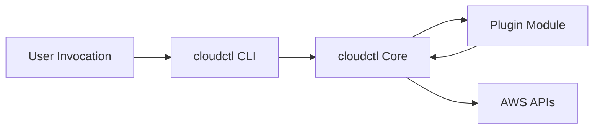
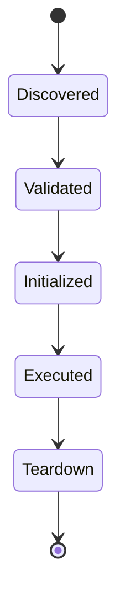

# Writing-Plugins.md

# 🔌 Writing Plugins

This document describes how to write **cloudctl plugins** safely and correctly. It serves as the authoritative guide for extending the tool's capabilities while maintaining its core security guarantees.

---

## 🎯 Purpose of Plugins

Plugins allow `cloudctl` to be **extended without modifying core code**, preserving the tool's security, trust, and execution guarantees.

**Plugins are intended for:**
* **Identity provider integrations:** (e.g., Okta, Entra ID, Ping Identity).
* **Enterprise-specific policy checks:** Custom validation logic for internal compliance.
* **Context enrichment:** Injecting metadata, tagging requirements, or environment validation.
* **Read-only introspection helpers:** Tools to assist the operator without altering state.

**Plugins are NOT intended for:**
* Mutating AWS infrastructure or state.
* Creating or persisting credentials and secrets.
* Acting as long-running agents or background daemons.

---

## 🏛️ Plugin Design Principles

All plugins must obey the following invariants to remain compliant with the `cloudctl` architecture:

* **Execution-Scoped:** Run only during the active `cloudctl` invocation.
* **Fail-Safe:** Any plugin failure must result in a safe abort without corrupting state.
* **Deterministic:** The same set of inputs must always yield the same output.
* **Non-Persistent:** No background processes or side-channel executions.
* **Policy-Aware:** Must respect and operate within established organizational guardrails.

---

## 🏗️ Plugin Architecture Overview

Plugins are loaded dynamically at runtime and executed within `cloudctl`’s **controlled execution boundary**.

### 🔄 Plugin Execution Flow (Mermaid)




**Key Properties:**
* **Isolation:** Plugins never interface directly with the shell or the user.
* **Guardrails:** Plugins cannot bypass core security checks.
* **Authority:** `cloudctl` Core remains the sole policy enforcement point.

---

## 📂 Discovery & Lifecycle

Plugins are discovered at startup via a central registry. Supported locations include built-in modules, installed Python packages, and explicit registry configurations.

### 🧬 Plugin Lifecycle (Mermaid)



---

## ✍️ Writing a Plugin

### Basic Structure
A plugin is a Python module that inherits from `PluginBase` and exposes a well-defined entry point.

```python
from cloudctl.plugins import PluginBase

class ExamplePlugin(PluginBase):
    name = "example"
    version = "1.0.0"

    def execute(self, context):
        # 1. Inspect context (Account, Role, Region)
        # 2. Enforce logic or policy
        # 3. Return modified context or raise error
        return context
```

### 📝 The Plugin Contract
* **Input/Output:** Must accept and return a `context` object.
* **Side Effects:** Avoid any side effects outside of context mutation.
* **Context Scope:** Includes user identity metadata, selected account/role, region, and execution mode.

---

## 🔐 Security Constraints

Plugins are **not trusted by default** and are subject to hard technical constraints.

### 🚫 Hard Constraints
Plugins must **NEVER**:
* Store or persist credentials/tokens.
* Write to disk outside of the designated temporary cache.
* Invoke shell commands or subprocesses.
* Modify AWS Organizations or call STS directly (all identity calls must go through Core).

### 🛡️ Guardrail Enforcement
All plugins are subject to:
* Region and Account allow/deny lists.
* Role sensitivity checks.
* Minimum client version enforcement.

---

## 🧪 Testing & Failure Modes

Plugins must be testable in isolation. Recommended testing includes unit tests for execution logic, negative tests for policy violations, and integration tests via the `cloudctl` test harness.

**Safe Failure Behavior:**
* **Abort on Error:** All failures (misconfiguration, IdP outage, etc.) must result in a safe abort.
* **No Partial Execution:** Never allow an execution to proceed if a plugin fails its validation.
* **Explicit Errors:** Raise controlled exceptions; never swallow errors or print secrets to the console.

---

## ⚖️ Design Invariants

* **Extension, Not Authority:** Plugins extend behavior, not permissions.
* **Core Authority:** Core always enforces policy.
* **Default Safety:** Failure is safe by default.

> [!IMPORTANT]
> If a plugin feels powerful, invisible, or autonomous—it has violated the `cloudctl` mission.

---

Would you like me to generate a specific implementation example for an identity provider integration (e.g., Okta)?